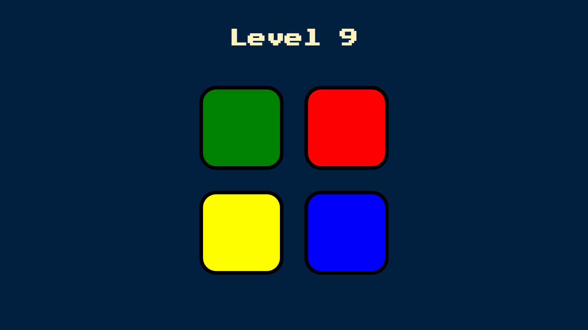
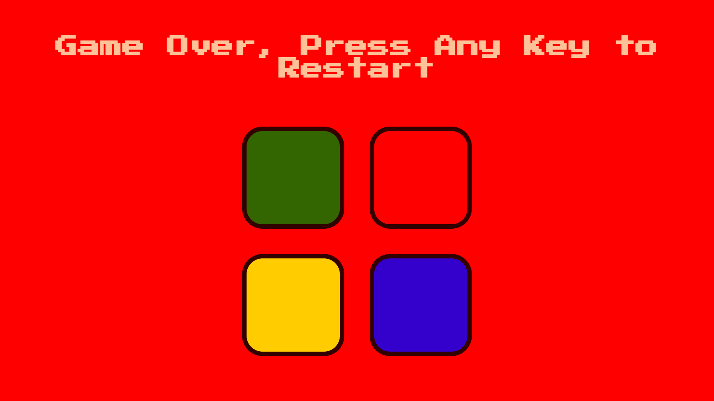

# The Simon Game

A game that is modeled off the game Simon. Made using HTML, CSS, Javascript and jQuery.

## How to Play this game?

The way it works is that you can press any key to start and it will show you a tile that you have to click on. And as you go from level to level, the patterns get more and more complicated, and at some point you're going to screw up, and its going to tell you that you've got it wrong and Game is Over!!

[Click Here to start the game](https://tomsaju2001.github.io/theSimonGame/){:target="_blank" rel="noopener"}

 

 

